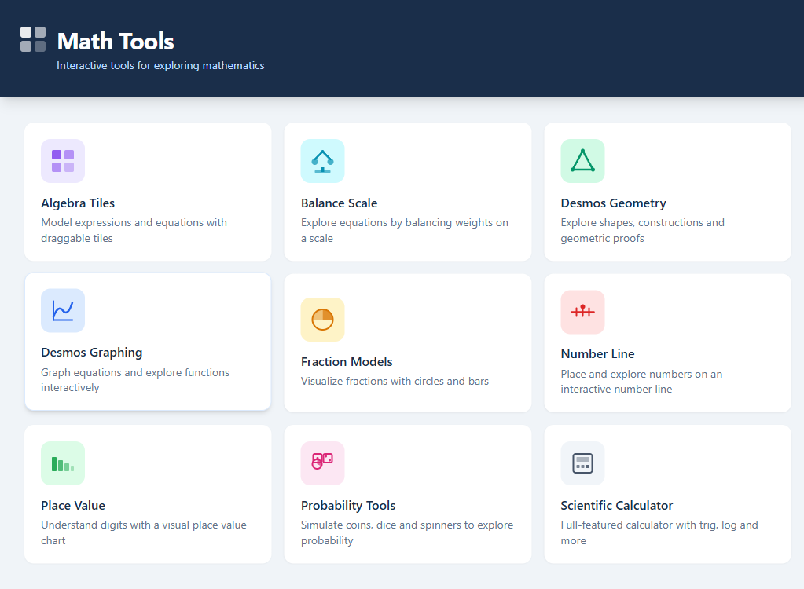
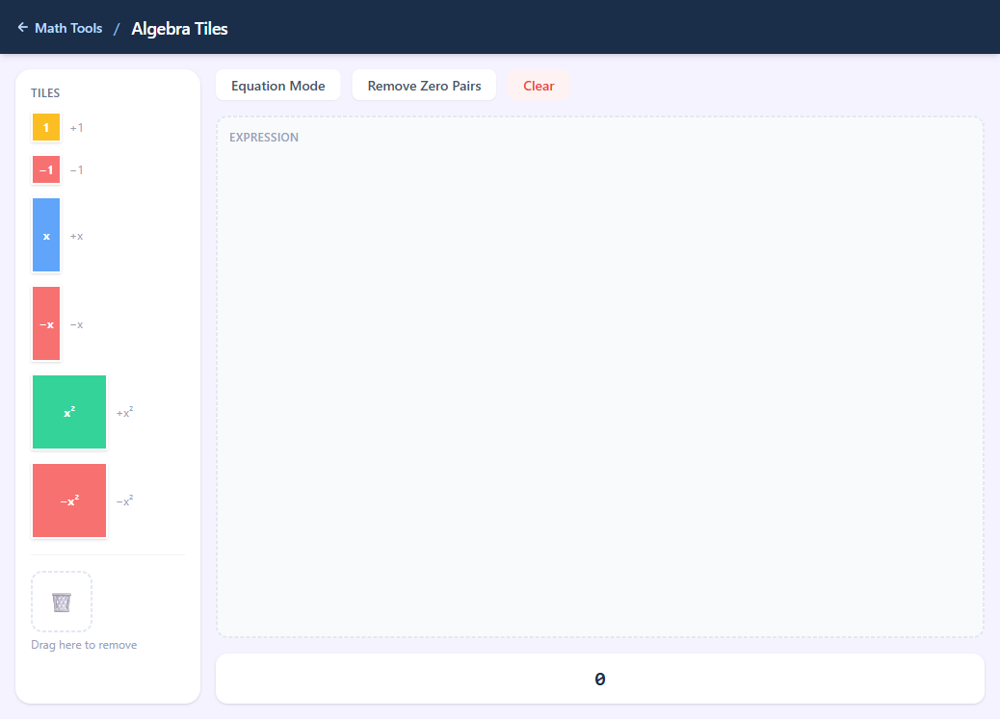
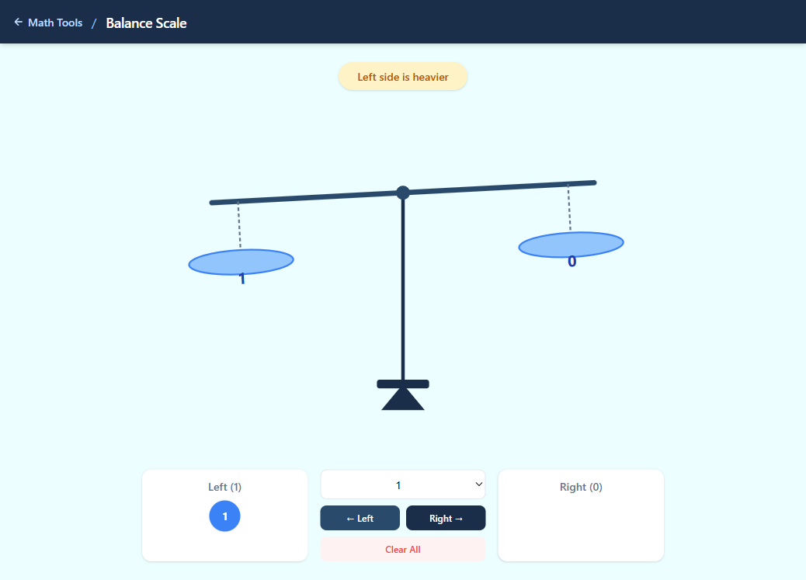
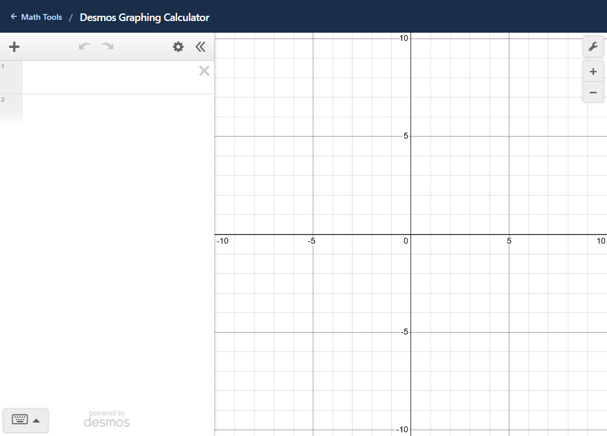
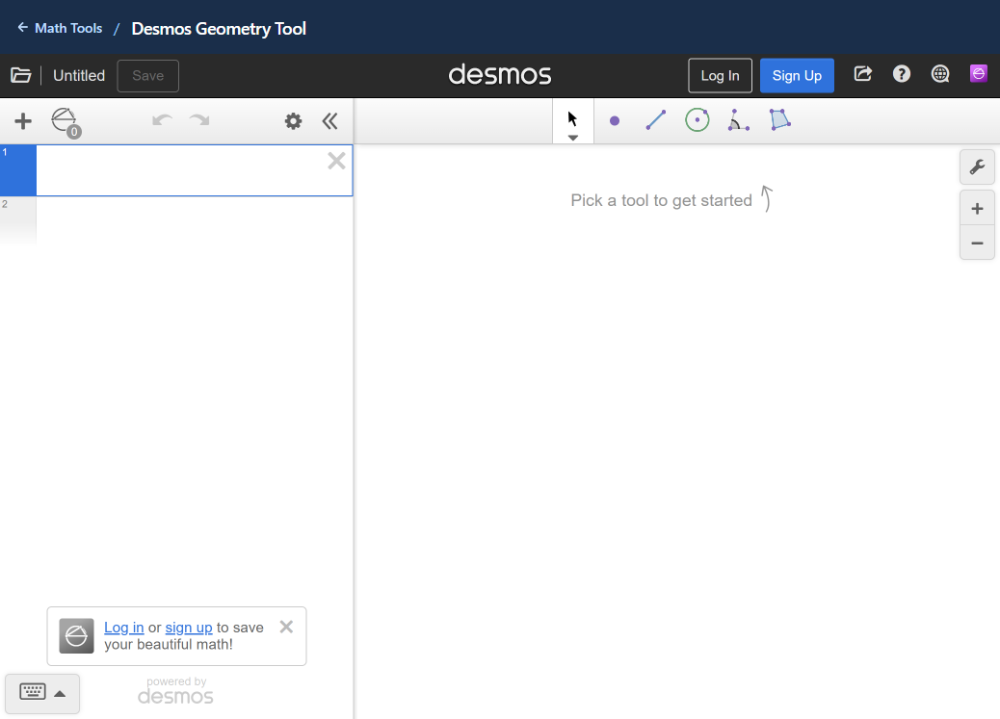
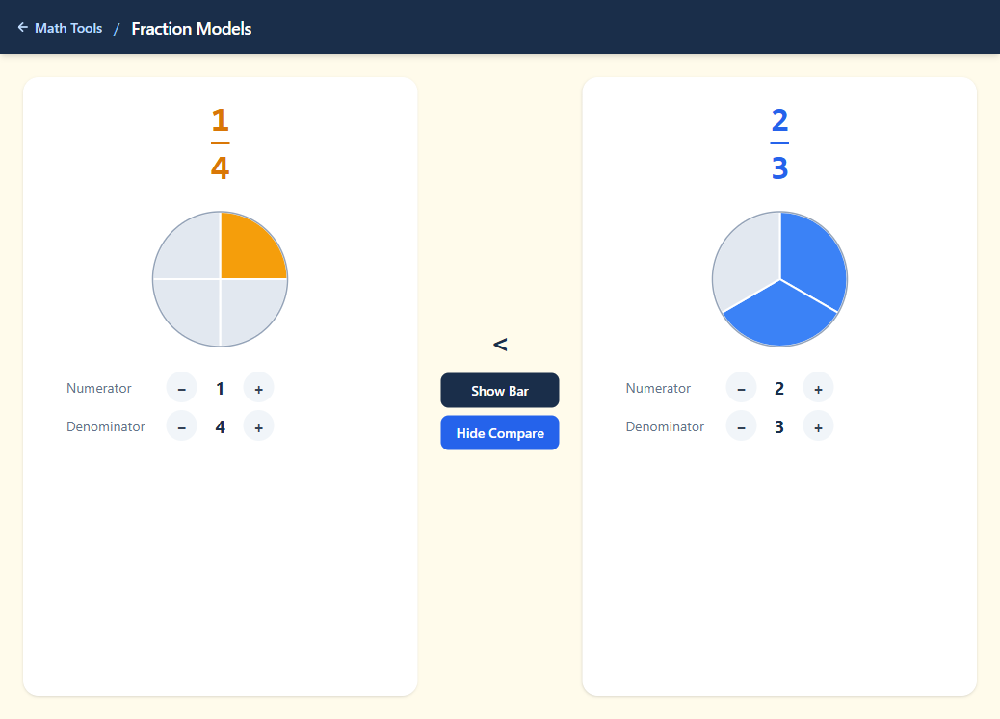
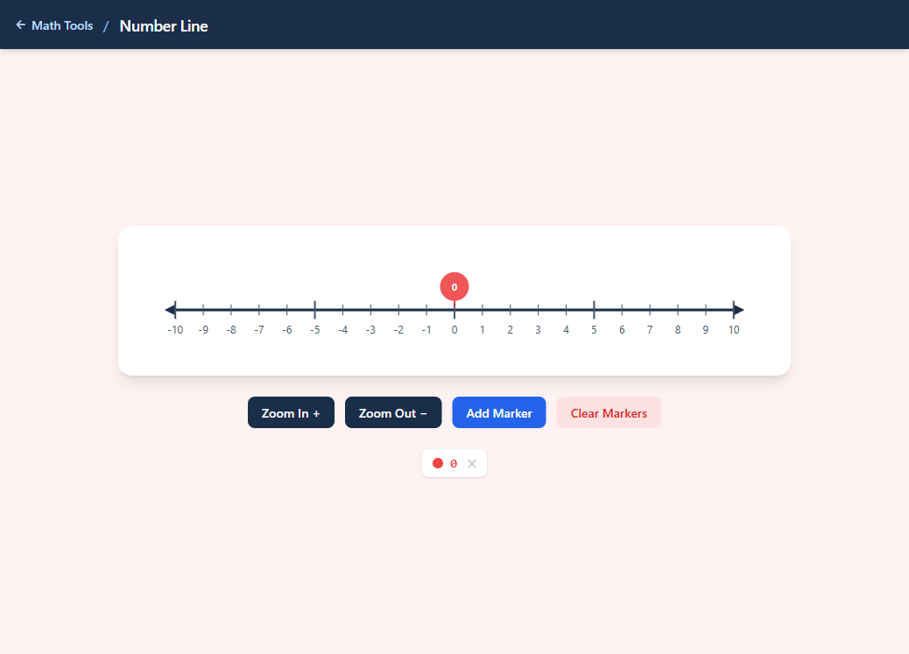
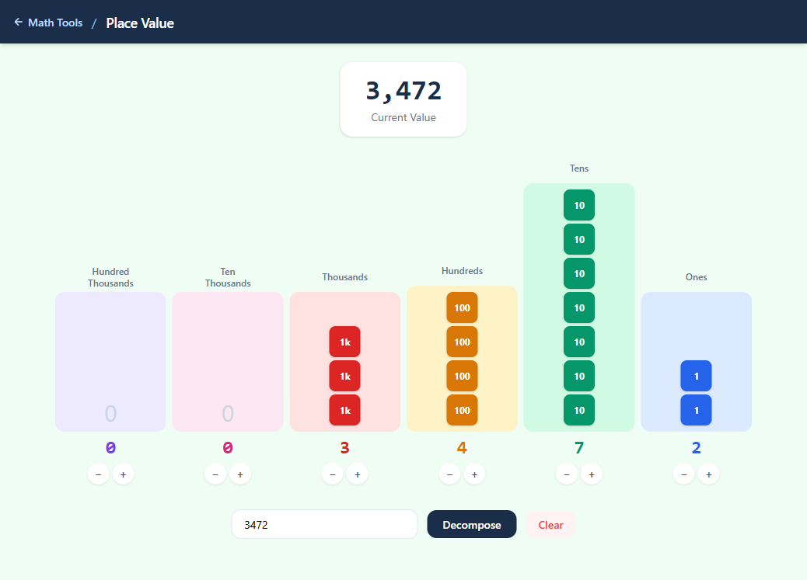
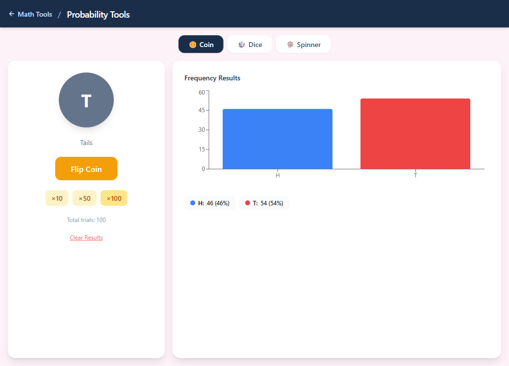
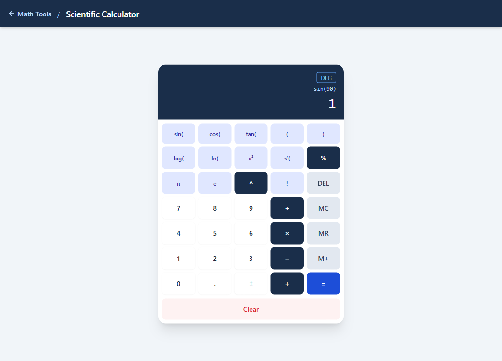

# Math Tools

An interactive math tools web app for students, inspired by [Big Ideas Math](https://www.bigideasmath.com). Built with React, Vite, TypeScript, and Tailwind CSS.



## Tools

### Algebra Tiles
Drag positive and negative unit, x, and x² tiles onto a board to model algebraic expressions and equations. Toggle equation mode to work with two sides, and remove zero pairs with one click.



### Balance Scale
Add weights to either side of a scale and watch it tilt in real time. Supports numeric weights (1, 2, 5, 10) and an unknown x — when balanced, it solves for x automatically.



### Desmos Graphing Calculator
Full Desmos graphing calculator embedded directly — graph equations, explore functions, and adjust settings interactively.



### Desmos Geometry Tool
Full Desmos geometry tool embedded — draw points, lines, circles, polygons, and geometric constructions.



### Fraction Models
Visualize fractions as SVG pie circles or bar models. Adjust numerator and denominator with steppers, switch between views, and enable compare mode to see two fractions side by side with a `<`, `=`, or `>` result.



### Number Line
An interactive SVG number line with draggable markers. Add multiple markers, zoom in and out, and see each marker's value update live as you drag.



### Place Value
Enter any number up to 999,999 and decompose it into color-coded block stacks for each place (ones through hundred-thousands). Adjust individual columns with + / − buttons.



### Probability Tools
Simulate coin flips, dice rolls, and a configurable spinner. Run single trials or batch runs (×10, ×50, ×100). Results display in a live frequency bar chart with percentages.



### Scientific Calculator
Full scientific calculator with trig (sin, cos, tan), logarithms (log, ln), exponents, square roots, factorials, π, e, and memory (M+, MR, MC). Toggle between DEG and RAD mode.



## Tech Stack

| | |
|---|---|
| Framework | React 19 + Vite 6 |
| Language | TypeScript |
| Styling | Tailwind CSS 3 |
| Routing | React Router 7 (hash-based) |
| Drag & Drop | @dnd-kit/core |
| Charts | Recharts |
| Math Engine | mathjs |

## Getting Started

> **Note:** `npm install` must be run on a local drive — Google Drive's filesystem cannot handle npm's concurrent writes.

### Option A — Run `setup.bat` (Windows)

Double-click `setup.bat`. It copies the project to `C:\Users\<you>\projects\MathTools` and runs `npm install` automatically.

### Option B — Manual

```bash
# Clone or copy to a local directory
git clone https://github.com/TokkatheDj/MathTools.git
cd MathTools

npm install
npm run dev
```

Open [http://localhost:5174](http://localhost:5174).

### Build for production

```bash
npm run build
```

The `dist/` folder can be opened as a static site directly from the filesystem (hash routing means no server is required).
